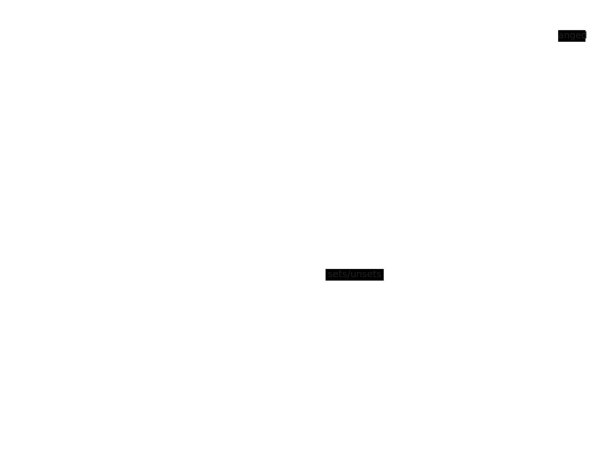

# Architecture

## Main Components

- popup/main.html / main.ts - Entry point for extension popup.
- scripts/replace_date.ts - Content script to replace `Date` and `Intl.DateTimeFormat` implementations. Runs in 'MAIN' (non-isolated) mode to be able to interfere with scripts in page context.
- scripts/send_active.ts - Content script that sends an event when the extension is active in the current tab. (used for keeping icon state in sync.) Runs in isolated mode to allow calling extension APIs.
- worker.ts - Background script / service worker to update UI state when changing tabs, navigating between sites, or when receiving events from send_active.ts.

