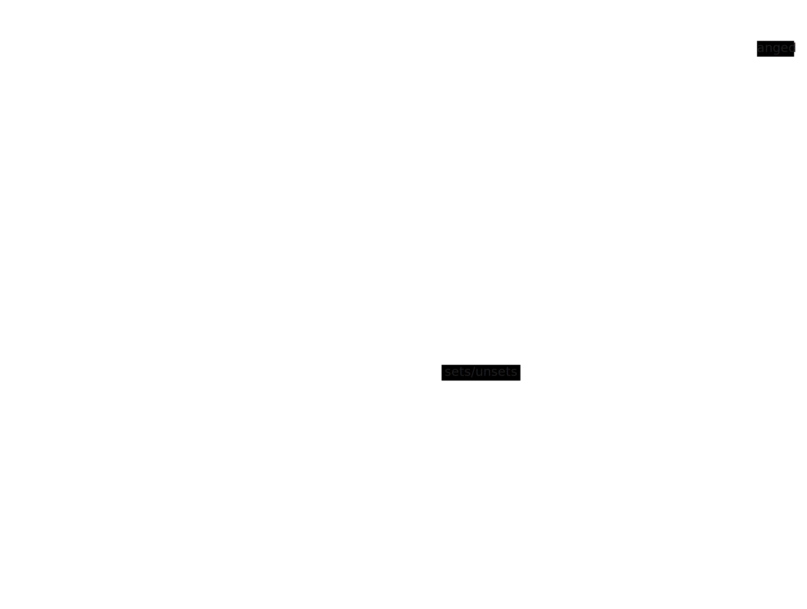

# Architecture

## Main Components

- popup/main.html / main.ts - Entry point for extension popup.
- content-scripts/replace-date.ts - Content script to replace `Date` and `Intl.DateTimeFormat` implementations. Runs in 'MAIN' (non-isolated) mode to be able to interfere with scripts in page context.
- content-scripts/send-active.ts - Content script that sends an event when the extension is active in the current tab. (used for keeping icon state in sync.) Runs in isolated mode to allow calling extension APIs.
- worker.ts - Background script / service worker to update UI state when changing tabs, navigating between sites, or when receiving events from send-active.ts.
- util/inject.ts - Functions injected by the popup (via `chrome.scripting`) to read and write the extension state. These run in 'ISOLATED' mode (see State Storage below).

## State Storage

The extension state (fake date, time zone, tick start timestamp) is stored in the page's `sessionStorage`. This keeps the state per-origin and scoped to the tab session, and makes it available to `replace-date.ts` at `document_start`, before any page script runs.

Because the state lives in page storage, hostile pages can interfere with it (see [#45](https://github.com/cpulvermacher/time-travel/issues/45) and [#54](https://github.com/cpulvermacher/time-travel/issues/54)). Two measures guard against this:

- **Reads in the content script** (`fake-date/storage.ts`) use a reference to `sessionStorage` captured at `document_start`, before the page can replace it. The current state is also cached in `window.__timeTravelState`, so it survives a page calling `sessionStorage.clear()` for the lifetime of the page.
- **Reads and writes from the popup** (`util/inject.ts`) are injected into the 'ISOLATED' world, whose `sessionStorage` bindings the page cannot tamper with (the underlying data is still shared with the page). After a write, the isolated-world function dispatches a `timeTravelStateUpdate` `CustomEvent` on `document`; `replace-date.ts` listens for it (in the 'MAIN' world) and re-reads the state.
- **Surviving reloads:** if a page clears or blocks `sessionStorage`, the live state is kept in `window.__timeTravelState` for the page lifetime. On `pagehide`, `replace-date.ts` writes the state back into `sessionStorage` (via the captured original methods), so the next load reads it at `document_start`. This works even if the page clears storage on every load.

Note: `pagehide` is not guaranteed to fire on abnormal teardown (tab crash, mobile tab discard); in those cases the state is lost on the next load.
